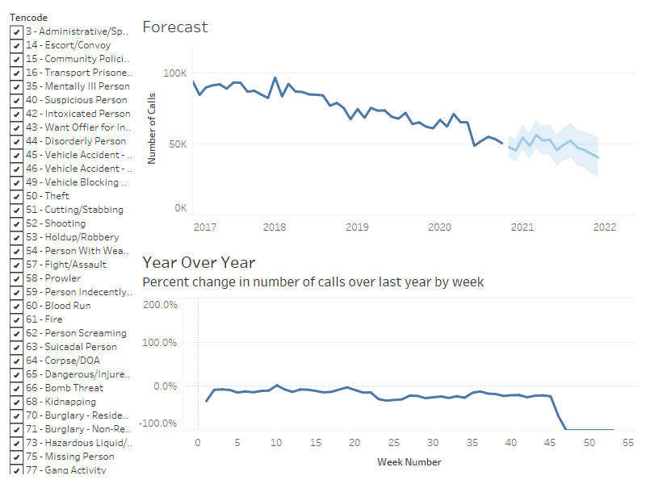
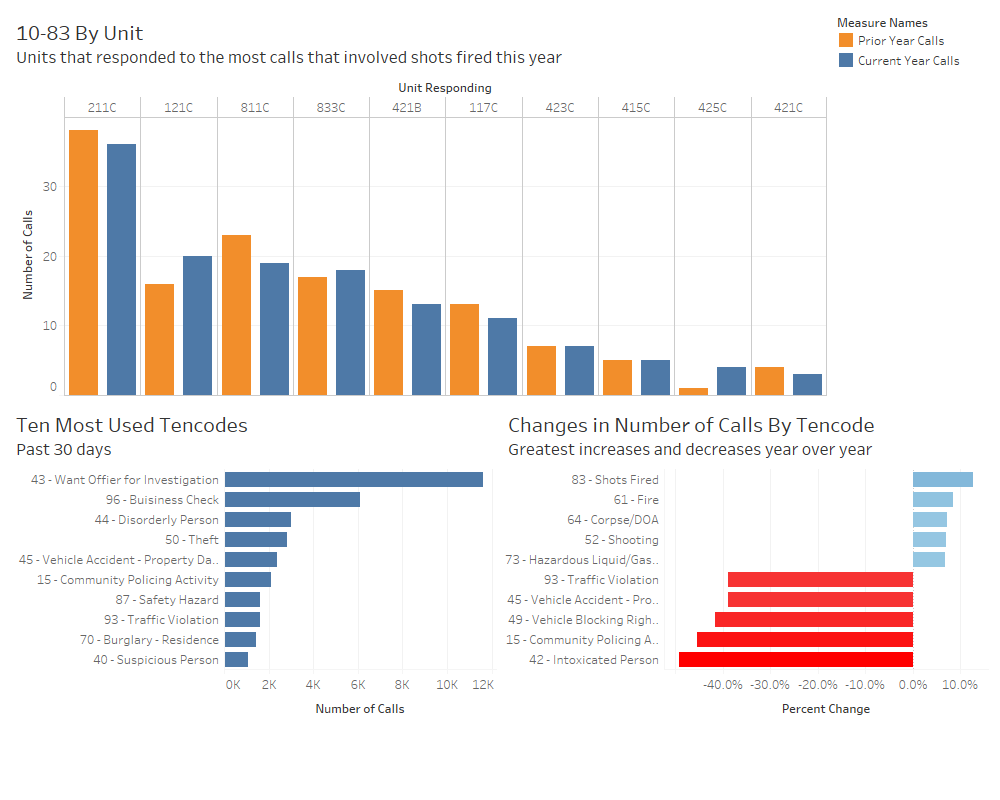

# Nashville Police Calls

## Executive Summary

## Dataset
The dataset was downloaded from [Nashville.gov](https://data.nashville.gov/Police/Metro-Nashville-Police-Department-Calls-for-Servic/kwnd-qrrm) as a CSV file and contains information about calls for police service in Nashville from January 1, 2013 through November 10, 2020. 

## EDA
The dataset includes over 8 million rows and has 19 columns. All but five of the columns contained more than 10% null values. This study focuses on three of the coulumns with less than 10% null values. Calls Received is the date and time the call was made. Tencode is the code used to identify the nature of the call. Unit Dispatched refers to the unit that responded to the call. 

Taking a quick look at the timeline for the entire dataset, the number of calls fluctuates but remains relatively steady until  2018, where we see a pretty significant drop from over 84k calls in August 2018 to less than 68k in December. Since then, the highest volume of calls was about 75.5k in March 2019. 

According to [The Tennessean](https://www.tennessean.com/story/news/crime/2019/04/18/nashville-traffic-stops-police-study-statistics-driving-while-black/3273143002/), traffic stops plummeted at the end of 2018 as MNPD shifted their strategy toward more targeted, community-based approaches.

This can be seen if we look at traffic stops (in green) compared to all other calls (in red). The traffic stops fall to almost insignificant numbers, while the non traffic calls closely match the total number of calls each month.

## Dashboards
There are two dashboards in the [Tableau workbook](https://public.tableau.com/views/MNPDCalls/KPIDashboard?:language=en&:display_count=y&:origin=viz_share_link), one giving a basic overview of the calls and the other highlighting three Key Performance Indicators.

### Overview Dashboard

The overview dashboard contains two charts, the forecast and the year over year change by week. The filter affects both charts.

The forecast shows the number of calls each month from 2017 through October 2020 and shows the projection through the end of 2021. Changing the filter will change the line chart and the forecast. Hovering over the line shows the month and the number of calls.

The forecast is a multiplicative model and takes into account seasonality. It is based on all calls from January 2013 through October 2020. The shaded area shows the 95% confidence interval. The RMSE of 3.688 and AIC of 1.578 are both lower than the additive model.

The Year Over Year chart shows the percent change in number of calls for each week over last year. A negative percentage indicates fewer calls this year. Again, changing the filter will change the line chart. Hovering over the line shows the number of calls this year, the number of calls last year, and the percent difference.

### KPI Dashboard

The KPI Dashboard has three bar charts. The first one shows the units that were involved in 10-83, or shots fired, calls. The next one shows the most used tencodes in the last 30 days. Finally, the last chart shows the tencodes that had the largest changes over last year.

